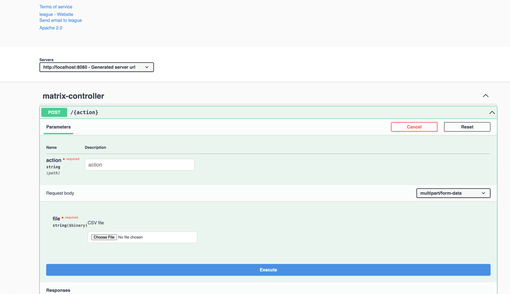

This solution runs on Java 17 locally and 21 on docker, and uses Maven as its package manager.
Option 1: Download the source code from the repository and run it locally.

After downloading the repository, you can run the following command to install the dependencies and run the tests:
```bash
mvn clean install
```

# Getting Started
cd into the project directory and run the following command to start the application:
```bash
mvn spring-boot:run
```

Option 2: Use the Docker image built with JAVA 21. This will  not run the tests, but will run the application.

You can build the Docker image and run the application by using the following command:
```bash
docker docker-compose up --build 
```

To run only the tests, you can use the following command:
```bash
mvn test
```
Onlly running the tests will generate the Jacoco report.

Added Jacoco for code coverage analysis.
To see coverage you need to run index.html in this directory:


For swagger documentation, you can access the following URL after running the application:
```
http://localhost:8080/swagger-ui/index.html
```

### Reference Documentation