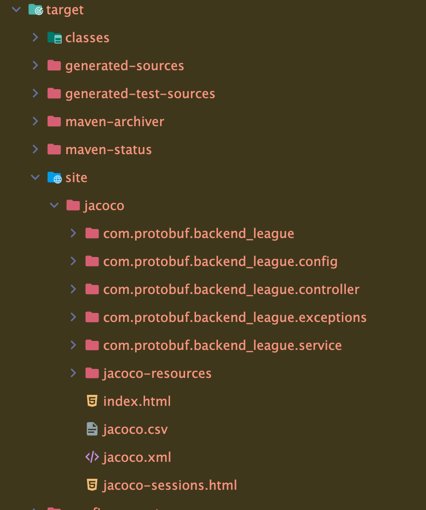
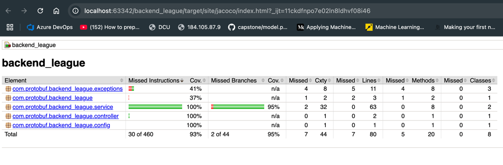

This solution runs on Java 21, and uses Maven as its package manager.

After downloading the repository, you can run the following command to install the dependencies:
```bash
mvn clean install
```

# Getting Started
cd into the project directory and run the following command to start the application:
```bash
mvn spring-boot:run
```

Added Jacoco for code coverage analysis.
To see coverage you need to run index.html in this directory:


### Reference Documentation